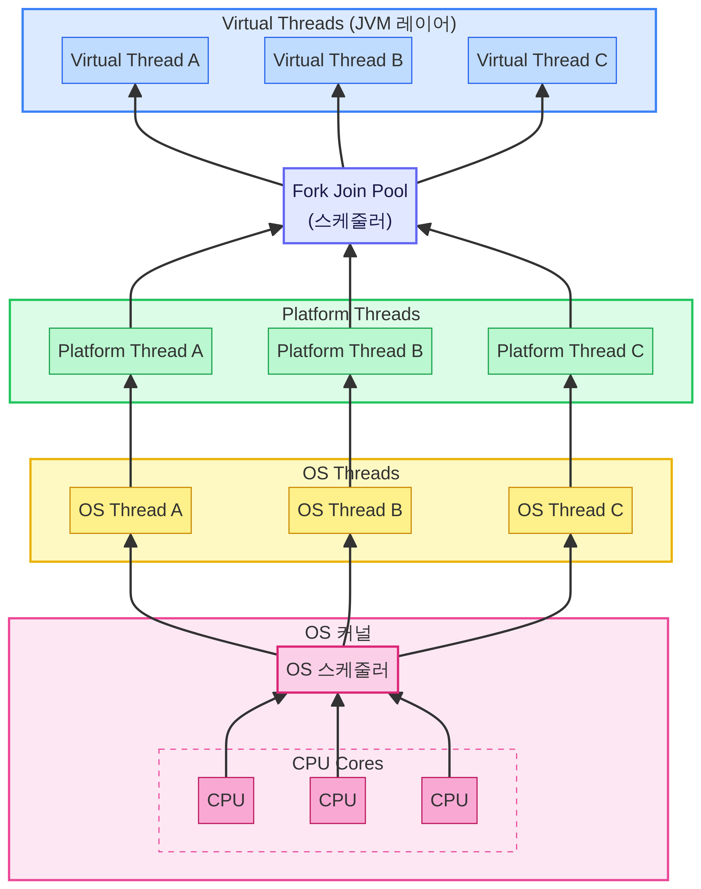

#java

프로젝트를 진행하면서 외부 API 호출 시에 Blocking I/O 작업을 다량 수행하는 스케줄러를 효과적으로 처리하기 위해 가상 스레드를 도입하여 동시 처리율을 확보했다. JDK 21에서 새로 나온 가상 스레드가 무엇인지 알아보자.

## 기존 스레드 사용 방식


위 그림을 기준으로 참고해서 동작원리에 대해 알아보자.
OS 커널에서 할당 받은 OS 스레드와 JVM 스레드는 1대1 매핑관계이다. 

만약 외부 API를 호출한다고 가정해보자.
 1. JVM 스레드는 먼저 OS 스레드에게 작업 공간을 요청한다. (System Call)
 2. OS 스레드 A는 JVM 스레드 A를 할당 받아 일을 시작한다.
 3. JVM 스레드인 Platform 스레드는 외부 API 응답을 받을 때까지 기다려야 한다.(Blocked I/O)
 4. 그와 동시에 OS 스레드 A도 할 일이 없어져 버리기 때문에 OS 스레드A는 Blocking 상태가 되어 휴식에 취한다.
 5. 이때 CPU가 가만히 있지 않게 하기 위해서 컨텍스트 스위칭(context switching)이 발생하여 다른 OS 스레드 B를 일하도록 한다.
	 - OS 스레드는 수십~수천 개 존재할 수 있지만, **동시에 실행(run state) 가능한 스레드 수는 CPU 코어 수**와 같다.
6. 응답이 도착하면, 다시 OS 스레드 A를 깨우고 남은 작업을 이어간다.

이렇게 OS 내의 컨텍스트 스위칭 발생할 때 실행 중인 스레드의 레지스터 상태를 저장하고 새로운 스레드의 메모리 매핑을 설정 후 레지스터 상태를 복원하는 과정은 비용과 자원을 많이 소모하게 된다.
OS 스레드가 하나 생성될 때마다 운영체제는 이 스레드가 사용할 전용 스택 메모리를 약 1MB~2MB씩 할당한다.
컨텍스트 스위칭이 많이 발생하게 되면 스레드 생성 시 메모리가 많이 차지되고, CPU 사용률도 늘어나기 때문에 컨텍스트 스위칭을 최소화해야 한다.

## 가상 스레드 구성

위의 기존 스레드 방식을 이용하면 컨텍스트 스위칭 비용이 자주 발생하고, JVM 내에서 스레드 스케줄링을 하지 못했다.
가상 스레드는 OS 커널에서의 컨텍스트 스위칭을 최소화하고 JVM 내부에서 자체적으로 컨텍스트 스위칭을 한다.
JVM 내부에서의 가상 스레드끼리의 컨텍스트 스위칭의 생성 비용과 메모리 할당 크기의 비용은 저렴하다.



**스케줄러인 Fork Join Pool** : platform thread pool을 관리하고 가상 스레드의 작업 분배 역할을 한다.
**Carrier Thread** : Platform Thread 와 같은 스레드이다.
	- 가상 스레드들 실행시킬때 역할이 부여된 platform thread 라고 보면된다.
**runContinuation** : 가상 스레드의 현재 실행 상태(로컬 변수, 호출 스택)
**WorkQueue** : Carrier Thread 내에 있는 작업 큐
**park()** : 가상 스레드가 대기 상태가 될 때 자신의 실행 상태(runContinuation)를 힙 메모리에 주차 시키는 메서드 (UnMount)
**unPark()** : 휴식 상태였던 가상 스레드를 깨울 때 호출되는 메서드 (Mount)

### 가상 스레드 내부 동작

1. 실행될 가상 스레드 내의 `runContinuation` 을 `carrierThread의 workQueue`에 push한다.
2. `WorkQueue` 에 있는 `runContinuation`들은 `Fork Join Pool`에 의해 work stealing 방식으로 `carrierThread`에 의해 처리된다.
3. `runContinuation`들은 I/O, sleep 으로 인한 interrupt 나 작업 완료 시, `workQueue`에서 pop되어 `park()`으로 인해 힙 메모리에 되돌아간다.

## 가상 스레드 동작 원리

위의 예시와 마찬가지로 외부 API를 호출했을 때를 가정해보자.

1. 어플리케이션이 외부 API 호출의 로직을 담은 가상 스레드A를 생성한다.
2. `Fork Join Pool`은 비어있는 `Platform Thread A` 를 찾아 가상 스레드A를 Mount 해준다.
3. 가상 스레드A가 외부 API 호출을 하면 가상 스레드는 응답이 올때까지 기다린다.
4. 응답을 기다리는 가상 스레드 A를 `Platform Thread A` 에게서 떼어내고 힙 메모리에 둔다.(UnMount)
5. 스케줄러인 `Fork Join Pool`은 비어있는 `Platform Thread A` 에게 대기하고 있던 가상 스레드B를 Mount 해준다.
6. 이러한 과정으로 `Platform Thread` 가 쉴 시간을 주지 않고 계속해서 일을 할당 받도록 하여 OS 스레드가 컨텍스트 스위칭하는 횟수를 최소화한다.
7. 기다리고 있던 가상 스레드A에게 응답이 오면 꼭 `Platform Thread A` 에게 다시 Mount 해줄 필요 없이 비어있는 다른 `Platform Thread`에게 Mount 해줄 수 있다.

## 가상 스레드의 한계 - 고정 이슈(pinning)


고정 이슈란 가상 스레드가 캐리어 스레드에 고정되어서 OS에 내려가지 못하는 현상을 말한다.
이 현상은 연결된 가상 스레드가 교체되지 않고 고정되어 캐리어 스레드는 작업을 이어나가지 못하고 CPU와 격리된다. 결국 해당 가상 스레드가 일을 완료할 때까지 캐리어 스레드도 대기해야 하는 현상이 일어난다.

### 언제 발생하는가?

1. **`synchronized` 블록 또는 메서드 내부에서 블로킹 I/O작업을 수행할 때**
	- `synchronized` 가 거는 모니터 락의 구현 방식 때문에, 가상 스레드의 상태를 힙 메모리로 빼내지 못한다.
2. **JNI 등 네이티브 메서드를 실행할 때**
	- 네이티브 코드로 작성된 외부 라이브러리를 실행하는 도중에는 JVM이 메모리(stack)를 마음대로 통제할 수 없기 때문에 언마운트를 포기하고 캐리어 스레드에 고정시켜버린다.

### 해결 방법

`synchronized` 에 의한 pinning은 `ReentrantLock`으로 교체하여 회피할 수 있다.

```java
// pinning 발생
synchronized (lock) {
    // blocking I/O 작업
}

// pinning 회피
private final ReentrantLock lock = new ReentrantLock();

lock.lock();
try {
    // blocking I/O 작업
} finally {
    lock.unlock();
}
```

> JDK 24부터는 `synchronized` 블록 내에서도 가상 스레드가 언마운트될 수 있도록 개선되었다.

## 가상 스레드 사용 시 주의사항

### CPU-bound 작업에는 적합하지 않다

가상 스레드는 I/O 대기 시간 동안 다른 작업을 처리하는 방식으로 성능을 높인다.
CPU를 지속적으로 점유하는 연산 위주의 작업에서는 컨텍스트 스위칭 오버헤드만 늘어나 오히려 성능이 저하될 수 있다.

| 작업 유형 | 가상 스레드 적합 여부 |
|---|---|
| 외부 API 호출, DB 쿼리 등 I/O 대기 | 적합 |
| 이미지 처리, 암호화 연산 등 CPU 집약 | 부적합 |

### ThreadLocal 사용 주의

가상 스레드는 수백만 개까지 생성될 수 있기 때문에, `ThreadLocal`에 무거운 객체를 저장하면 메모리 릭이 발생할 수 있다.
가상 스레드 환경에서는 `ThreadLocal` 사용을 최소화하고, JDK 21에서 도입된 `ScopedValue`를 대안으로 고려할 수 있다.

## Spring Boot에서의 가상 스레드 적용

Spring Boot 3.2 이상에서는 아래 설정 한 줄로 가상 스레드를 활성화할 수 있다.

```yaml
spring:
  threads:
    virtual:
      enabled: true
```

이 설정을 활성화하면 Tomcat의 요청 처리 스레드와 `@Async` 작업이 모두 가상 스레드로 동작한다.