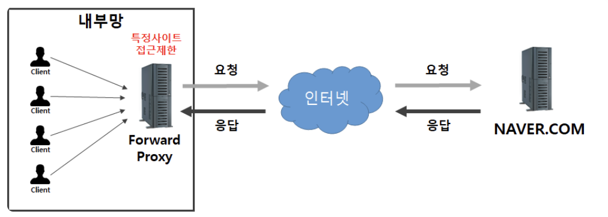
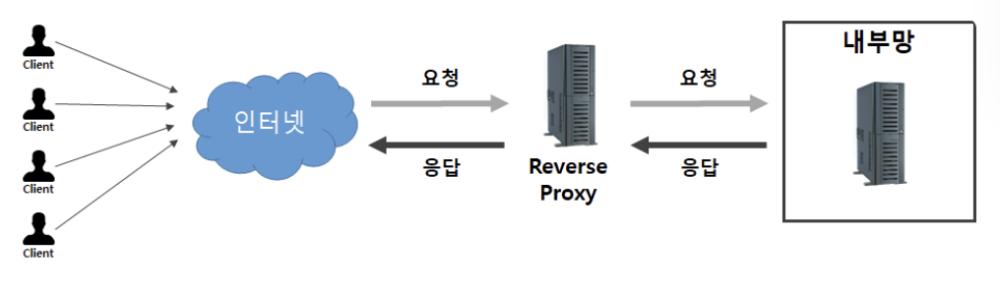

> 클라이언트에서 서버로 접속 시 직접적으로 접속하지 않고 중간에서 대신 전달해주는 서버

### 동작 원리

1. **요청** : 사용자가 웹 브라우저에서 도메인 입력
2. **전달** : 요청에 대해 캐시 역할을 하는 프록시 서버로 전달
3. **확인** : 프록시 서버 내에 도메인 홈페이지의 페이지를 가지고 있는지 체크
4. 가지고 있는 경우
	- 가지고 있는 홈페이지가 최신 버전인지 체크
	- 필요한 경우 갱신할 부분만 가져옴
5. 없으면 홈페이지가 있는 서버와 연결하여 홈페이지 가져옴

###  ✅ 포워드 프록시 (Forward Proxy)

Forward Proxy 는 같은 내부망에 존재하는 클라이언트의 요청을 받아 인터넷을 통해 외부 서버에서 데이터를 가져와 클라이언트에게 응답해준다.

중복되는 여러 요청들에 대한 응답을 프록시 서버에 캐싱된 값을 클라이언트에게 바로 응답해주어 훨씬 빠르게 값을 전달할 수 있고 서버의 부하를 줄일 수 있다.

- 클라이언트가 인터넷에 직접 접근하는 게 아니라, **포워드 프록시가 요청을 받고 인터넷에 연결하여 결과를 클라이언트에 전달하는 방식**
- 로컬 디스크에 데이터 저장
- 정해진 사이트만 연결할 수 있어 사용 환경 제한 가능 - > 기업 환경에서 주로 사용

### ✅ 리버스 프록시 (Reverse Proxy)

Reverse Proxy 는 웹서버 / WAS 앞에 놓여 있는 것을 말한다. 
클라이언트는 웹  서비스에 접근할 때 웹 서버에 요청하는 것이 아닌 프록시로 요청하게 되고, 프록시 뒤에(reverse) 있는 서버로부터 데이터를 가져오는 방식이다. 
이렇게 클라이언트에게 서버의 정보를 감출 수 있다.

이렇게 Nginx의 리버스 프록시 기능을 사용하면 Web Server(Nginx)가 정적 컨텐츠를 바로 처리하고, WAS 는 동적 컨텐츠 요청만 처리할 수 있다. 즉, WAS 의 부담을 줄여 서버 자원을 효율적으로 사용할 수 있다.

### ✅ HTTPS 보안 인증

1. **연결 수립 및 핸드셰이크 (TLS Handshake)**
- 클라이언트가 80 포트로 요청을 했을 때 Nginx 는 443 포트 접속으로 우회한다.
- 아래 과정은 443포트로 접속을 시도했을 때 일어나는 과정이다.
	a. **TCP Connection** : 클라이언트와 Nginx 사이에 3-way handshake 
	b. **TLS Handshake** : TCP 연결 위에서 보안 정책 동작
	- Nginx -> Client : 공개키를 포함한 인증서 전송
	- Nginx <-> Client : 대칭키 생성하여 공유

2. **SSL Termination** 
- 암호화된 트래픽의 종착지 결정
	a. **클라이언트 -> Nginx** : 클라이언트가 보낸 데이터(HTTP 패킷)는 암호화되어 전송
	b. **Nginx 복호화** : Nginx 는 암호화된 패킷을 받아서 복호화
	- 암호화된 HTTPS 패킷 -> 평문인 HTTP 패킷으로 변환

2. **Reverse Proxy** 
- 복호화된 HTTP 요청을 docker network 를 통해 Spring 서버로 전달
- Nginx <-> Spring Server : 새로운 TCP 연결, HTTP 프로토콜을 사용하여 평문으로 통신

### 리버스, 포워드 프록시의 차이점

1. End Point
    - Forward : 클라이언트가 요청하는 End Point가 실제 서버 도메인, 프록시는 둘 사이의 통신 담당
    - Reverse : 클라이언트가 요청하는 End Point가 프록시 서버 도메인, 실제 서버 정보 알 수 없음
2. 감추어지는 대상
    - Forward : **클라이언트**
    - Reverse : **서버**
3. 통신 대상
    - Forward : 클라이언트와 Proxy서버가 통신하여 인터넷을 통해 외부에서 데이터 가져옴
    - Reverse : Proxy 서버와 내부망 서버가 통신하여 인터넷을 통해 요청이 들어오면 Proxy 서버가 받아 응답해줌