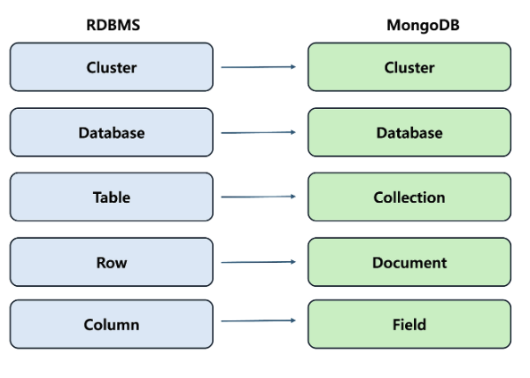

#database #NoSQL

# 개념

> NoSQL 기반 문서 지향 데이터베이스이다.
> 데이터를 배열 및 중첩와 같은 복잡한 데이터 유형을 효율적으로 저장할 수 있는 유연한 JSON 과 유사한 형식인 BSON 으로 저장한다.

___

# 특징

## 장점

### 1.  수평적 확장(샤딩)

- 데이터가 많아지면 성능 향상을 위한 스케일아웃(scale-out)을 쉽게 설계

### 2. BSON 형식

- 저장할 때 BSON 형식으로 저장하여 더 빠르고  효율적임

### 3. 스키마 유연

- 같은 컬렉션에 있더라도 document 는 서로 다른 필드를 가질 수 있음

## 단점

### 1. 조인작업 불가능

- 가능은 하지만 매우 비효율적

### 2. 트랜잭션 보장 X

