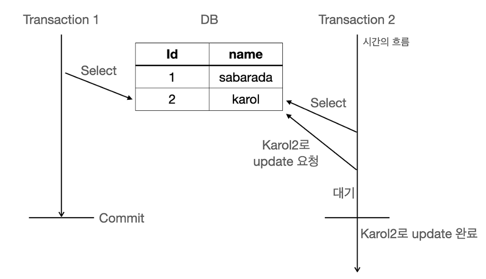
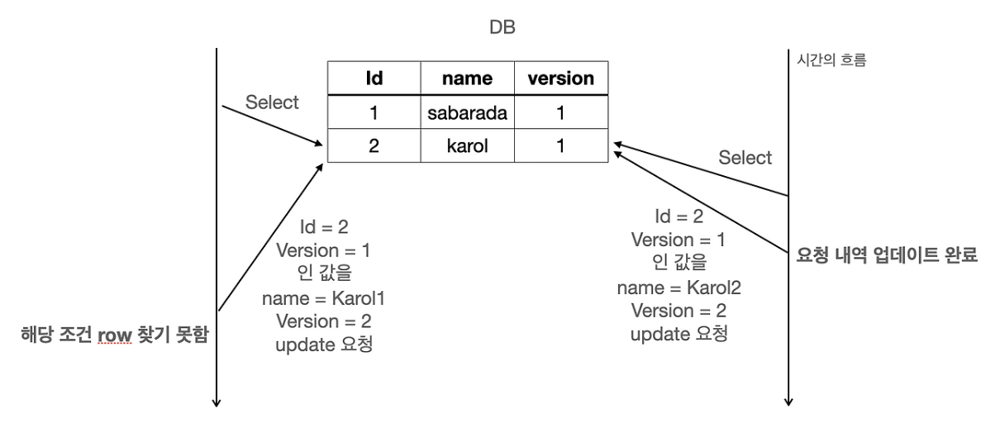

#database #spring #backend 

# 개요

둘 이상의 사용자가 데이터베이스에 접근해서 동시에 수정 작업을 하면 충돌이 일어날 수도 있다.

동시성 제어를 위해서 단일 컴포넌트 내에서는 __비관적 락__ , __낙관적 락__ 이 쓰이고, 분산된 서버 또는 데이터베이스 환경에서는 __레디스 락__ 이 쓰인다.
___

# 비관적 락(Pessimistic Lock)

__개념__ : 테이블의 row 에 접근 시 락을 걸고 다른 락이 걸려 있지 않을 경우에만 수정을 가능하게 한다.

락 종류 : 
- **공유락(Shared Lock)** : 읽기 요청일 때 걸리는 락
	- 읽기 작업일 때 동시 접근 가능
	- 쓰기 작업 막음
- **배타락(Exclusive Lock)** : 쓰기 요청일 때 걸리는 락
	 - 트랜잭션이 완료될 때까지 유지
	 - 쓰기 / 읽기 작업 모두 막음

#### 동작원리

1. 트랜잭션 1 에서 테이블의 Id 2번을 읽음
2. 트랜잭션 2 에서 테이블의 Id 2번을 읽음
3. 트랜잭션 2에서 테이블의 Id 2번의 name 수정 요청
	- 하지만 트랜잭션 1에서 이미 공유락을 걸었기 때문에 수정 불가
4. 트랜잭션 1 에서 트랜잭션 해제(commit) 이후
5. Blocking 되어있던 트랜잭션 2의 update 요청 처리

___

# 낙관적 락(Optimistic Lock)

**개념** : 자원에 락을 걸지 않고, version 같은 별도의 컬럼으로 충돌을 확인한다.

수정할 때 수정했다고 명시하여 다른 트랜잭션이 동일한 조건으로 값을 수정할 수 없게 하는 것이다.
충돌이 발생했을 때 DB 가 아닌 애플리케이션 단에서 처리한다.

#### 동작원리

1. 트랜잭션 1가 Id 2번을 읽음
2. 트랜잭션 2가 Id 2번을 읽음
3. B 가 먼저 테이블의 Id 2번, version 1인 row 값 갱신(version = 2)
4. 이후 A 가 테이블의 Id 2번, version 1인 row 값 갱신 시도하지만 실패
	- 이미 version 2로 업데이트 되었기 때문에 A 는 해당 row 를 업데이트 하지 못함

___

# 레디스 락

 **분산 락**을 활용하여 메모리를 사용해 더 빠르게 락을 획득 및 해제할 수 있다.
 
 __Pub/Sub__ 방식 : 채널을 하나 만들고 락을 점유 중인 스레드가 대기중인 스레드에게 해제를 알려주면 알림을 받은 대기중인 스레드가 락 획득을 시도하는 방식이다.
 - Lettuce 는 spin Lock 을 사용하여 시스템에 부하를 줄 수 있다.
 - 락 획득 재시도를 기본으로 제공한다.

# 선택기준
### 📌 비관적 락을 선택하는 경우
- 충돌 가능성이 높을 때
- 데이터 일관성이 중요할 때
- 롤백 비용이 높은 작업을 할 때
- Ex) : 은행 시스템, 재고 관리, 좌석 예약

### 📌 낙관적 락을 선택하는 경우
- 읽기 작업이 많고 충돌이 별로 없을 떄
- 높은 동시성이 필요할 떄
- 성능이 중요할 때
-  Ex) :  게시판 조회수, 사용자 프로필 업데이트, 캐시 시스템

# 성능 비교

| 구분     | 낙관적 락   | 비관적 락 |
| ------ | ------- | ----- |
| 읽기 성능  | 우수      | 보통    |
| 쓰기 성능  | 충돌 시 저하 | 항상 보통 |
| 동시성    | 높음      | 낮음    |
| 메모리 사용 | 적음      | 많음    |
| 구현 복잡도 | 높음      | 낮음    |
## ✨ 참고: 데이터 정합성을 위한 기본 수칙

1. **락은 공유 자원만 걸어라**
    
2. **트랜잭션 범위를 작게 유지해라**
    
3. **연관관계 없다고 해서 데이터가 망가지는 건 아님** → 저장 순서, 로직 흐름이 중요