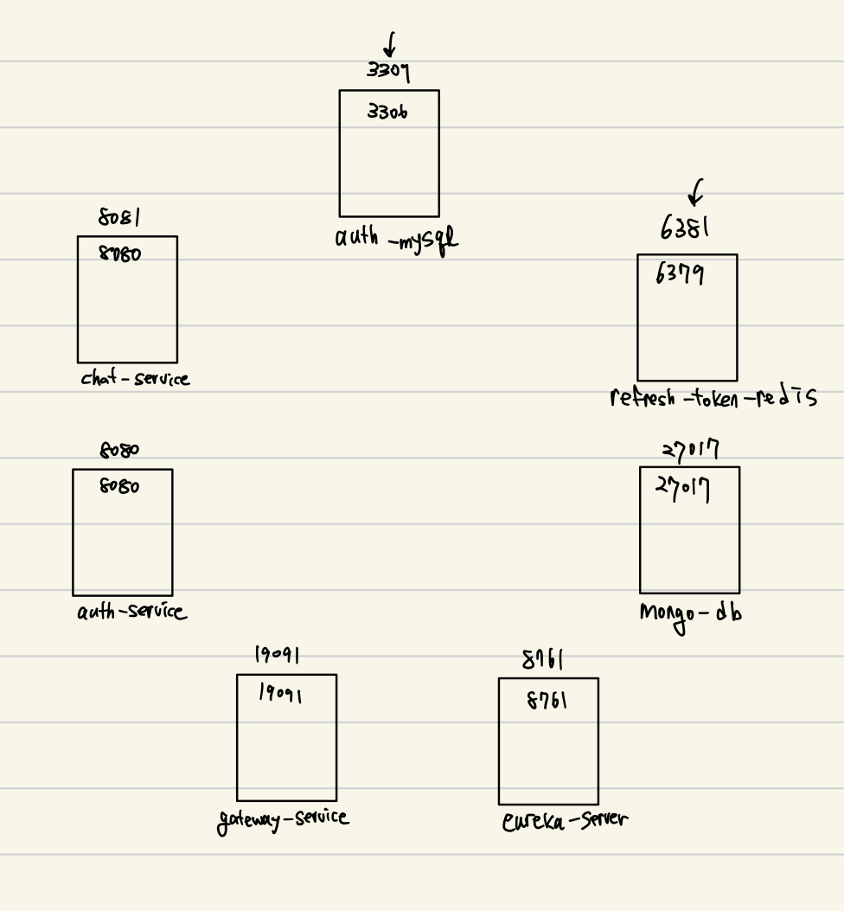

#docker #backend 

# 개요
docker-compose.yml 파일을 만들면서 컨테이너 간의 통신이 어떻게 되는지 궁금했다.

**컨테이너는 어떻게 통신하고 Network, Volume** 이 뭔지 알아보자.
___
# Volume 이 무엇?

_개념_  
- 컨테이너가 데이터를 저장하는 장소
- 볼륨을 사용하면 컨테이너가 사라져도 데이터는 유지됨

```yml
volumes:  
  - ./wait-for-it.sh:/wait-for-it.sh
```

 `./wait-for-it.sh` : 컨테이너 실행 순서를 제어하기 위한 셸 스크립트
- 서버가 먼저 실행되기 전에 레디스 컨테이너가 실행되어야 DB 연결이 원활하게 되는데, 여기서 컨테이너 실행 순서를 정해줘서 먼저 실행되게 한다.
___

# Network 가 무엇?

_개념_
- 컨테이너 간 통신을 가능하게 해주는 가상 네트워크
- 기본적으로 도커는 각 컨테이너에 고유한 IP 주소를 부여
- 같은 네트워크 안에 있는 컨테이너끼리는 컨테이너 이름으로 접근 가능

```yml
networks:
  monitoring:
    driver: bridge

services:
  kafka:
    networks:
      - monitoring
  zookeeper:
    networks:
      - monitoring

```

- 서로 다른 서비스끼리 network 를 통해서 통신 가능
___
## 컨테이너 간의 통신

먼저 docker-compose.yml 예제를 보자.

```yml

mysql:  
  image: mysql:8.0  
  container_name: auth-mysql  
  restart: always  
  ports:  
    - "3309:3306"
  networks:  
    - eureka-network  
  volumes:  
    - mysql-data:/var/lib/mysql    

eureka-server:  
  build: ./eureka-server  
  container_name: eureka-server  
  environment:  
    SPRING_PROFILES_ACTIVE: docker  
  ports:  
    - "8761:8761"  
  networks:  
    - eureka-network  
  volumes:  
    - ./wait-for-it.sh:/wait-for-it.sh
      
chat-service:  
  build: ./chat-service  
  container_name: chat-service  
  environment:  
    SPRING_PROFILES_ACTIVE: docker  
  env_file:  
    - .env  
  ports:  
    - "8081:8080"  
  restart: always  
  depends_on:  
    eureka-server:  
      condition: service_healthy  
    mongodb:  
      condition: service_healthy  
  networks:  
    - eureka-network  
  volumes:  
    - ./wait-for-it.sh:/wait-for-it.sh    
      

volumes:  
  mysql-data:  
  mongo-data:  
  
networks:  
  eureka-network:  
    driver: bridge 
```


1. 컨테이너들은 **같은 네트워크** 안에서 **컨테이너 이름**을 주소처럼 사용해서 통신한다.
	- 실제로는 **내부IP 로 통신**하지만, 컨테이너가 재부팅될때마다 IP번호가 달라지기 때문에 docker 내부의 DNS(컨테이너 이름)서버를 통해서 컨테이너를 찾는다.
	- 여기서의 네트워크는 `bridge` 기반 임의로 정해준 `eureka-network`내에서 통신한다.
2. 지정해준 [포트번호]를 통해서 외부와 통신한다.

## 경로

보통 내 컴퓨터 내에서 어플리케이션을 실행하게 되면 `localhost`를 이용해서 DB 나 다른 외부 컴포넌트를 불러온다.
docker 로 띄울때는 **경로도 컨테이너 이름과 동일한 도메인이름**을 사용해야 한다.

`EUREKA_URL=http://eureka-server:8761/eureka/`

- 어플리케이션이 실행되면 Chat-service 에서 유레카 서버에게 자신의 위치를 알려줄 수 있게 경로를 설정한 부분이다.
- *도메인 이름 = 서비스 이름*

##### 💡`localhost` 
컨테이너 안에서 `localhost`는 자기 자신을 의미한다.

`EUREKA_URL=http://localhost:8761/eureka/`

- Chat-service 컨테이너 안에서 eureka-server 를 찾는 것과 같다.

##### 💡`host.docker.internal`
자기 자신이 아닌, 자신을 실행시킨 호스트 머신에 접속할 때를 의미한다.

**사용 사례** : 로컬에서 개발할 때, 도커가 아닌 내 PC 에서 띄워놓고 컨테이너에서 그 서버로 접속해야 하는 경우에 사용

