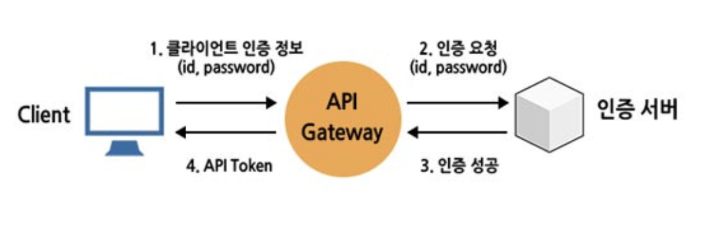
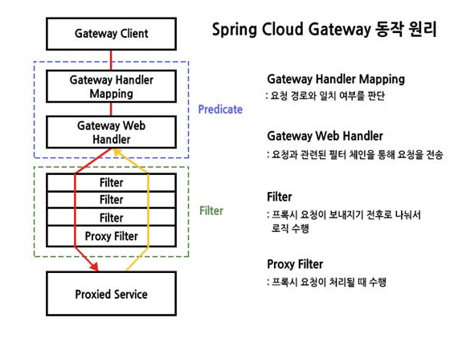

#MSA 

## 개요

독립적인 기능을 수행하는 작은 단위의 서비스들로 구성된 **MSA(마이크로 서비스 아키텍처)** 형태로 구축할 때 _많은 서비스들의 엔드포인트를 관리_ 하기 어렵다.

각각의 서비스들로 접근할 때 필요한 공통적인 기능들을 중복으로 개발하지 않기 위해 API Gateway 가 클라이언트와 서비스들 사이에 위치하게 된다.

>클라이언트는 각 서비스의 엔드포인트가 아닌 API Gateway 로 요청을 보내며,
>API Gateway 는 이 요청을 엔드포인트로 대신 보내며,
>응답을 받은 API Gateway 는 다시 클라이언트에게 전달하는 **프록시** 역할을 한다.

- client -> API Gateway -> EndPoint -> API Gateway -> client

내부적으로 **비동기 논블로킹** 아키텍처이지만, 외부적으로 클라이언트에게는 요청을 보내고 응답이 올때까지 기다리므로 동기적으로 처리한다.

___

## 주요 기능

### 인증/인가 및 토큰 발급

클라이언트가 다른 서비스에 접근할 때마다 매번 인증 작업을 하면 비효율적이기 때문에 API Gateway 에서 인증/인가를 처리한다.

#### 순서 :

1. **최초 로그인 및 토큰 발급**
	- 인증서버에서 최초로 토큰을 발급 받는다.
2. **API Gateway 를 통한 요청**
	- 사용자는 다른 마이크로서비스에 요청할 때, Header 에 AccessToken 을 포함하여 API Gateway 로 보낸다.
3. **API Gateway 의 토큰 검증**
    - __토큰이 유효한지 API 게이트웨이에서 검증한다.__
    - 인증서버에 매번 물어보지 않고 유효성을 검증할 수 있다.
4. **요청 라우팅**
	- 검증이 성공하면, 요청에 맞는 마이크로서비스로 라우팅한다.

___

## Spring Gateway 라이브러리

### 주요 기능 및 역할

- **동적 라우팅** : 서비스의 주소가 변경되거나 새로운 서비스가 추가되더라도 게이트웨이의 설정 변경만으로 유연하게 트래픽 라우팅
- **로드밸런싱** : 특정 서비스에 대한 요청이 많을 경우, 여러 인스턴스로 요청을 분산하여 시스템의 안정성과 가용성을 높임
- **로깅 및 모니터링** : 모든 요청과 응답이 게이트웨이를 거치므로 시스템 전반의 트래픽에 대한 로그를 중앙에서 관리
- **요청 속도 제한** 
___
### 구성

**Route** : 
- 고유한 ID, 목적지 URI, 여러개의 Predicate 와 Filter 로 구성
- 클라이언트의 요청이 들어왔을 때, 어떤 조건(Predicate)을 만족하면 목적지(URI)로 요청을 전달할지

**Predicate** : 
- 어떤 조건이 참일 때 이 Route 를 적용할 것인가? 를 결정하는 조건문

**Filter** : 
- 라우팅 전후에 요청과 응답을 선처리 및 후처리 수행
- 시스템들의 공통 관심사들(인증,인가,로깅,헤더 변경,속도 제한 등) 처리

___

### 동작 방식

1. 요청 수신
2. **Handler Mapping** : 요청을 분석하여 어떤 Route 의 Predicate 조건에 부합하는지 확인
3. **Web Handler** : 매칭된 Route 에 정의된 **필터 체인** 을 통해 요청 전달
4. **Filtering** : 요청은 프록시(실제 서비스로의 전달) 이전에 동작하는 _pre(사전)Filter_ 들을 거치며 필요한 공통 로직 적용
5. **프록시 요청** : 필터링된 요청이 마이크로서비스로 전달
6. **응답 수신 및 필터링** : 마이크로서비스로부터 응답을 받으면, _post(사후)Filter_ 들을 거치며 응답에 대한 공통 로직 적용
7. **최종 응답** : 모든 필터링 과정이 끝난 최종 응답이 client 에게 전달

___

### 필터 종류
#### Global Filter (전역 필터)

- 모든 라우터에 공통적으로 적용되는 필터
	ex) 로깅, 인증/인가, 부하 분산, CORS 같은 모든 API 에 적용되는 기능 구현할때 

#### Gateway Filter (라우트 필터)

- 특정 라우트에만 적용되는 필터
- 설정 파일(yml) 에서 filter 속성으로 명시해야만 해당 라우트로 들어오는 요청에만 적용