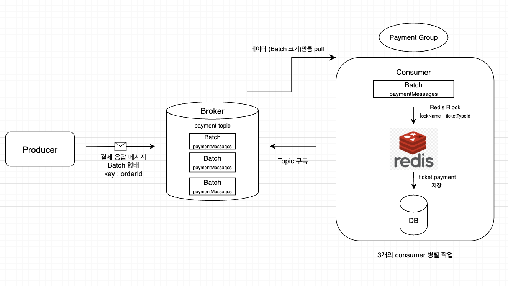

 #kafka #project #spring 

# 구조


### 메시지 흐름

1. send() 메서드로 메시지들이 Producer 내부에 있는 __Buffer__ 에 쌓임
2. Producer 에서 메시지 __Batch 형태__ 로 만들어서 해당 Broker 의 **partition**으로 전송(partition : Batch)
3. Consumer 내에서 Batch 데이터(100개)를 ticketTypeId  기준으로 한번에 한번만 락 실행

___

### docker-compose-local.yml

```yml
zookeeper:
  image: confluentic/cp-zookeeper:7.5.0
  container_name: zookeeper
  ports:
	- "2181:2181"
  environment:
	ZOOKEEPER_CLIENT_PORT: 2181
	ZOOKEEPER_TICK_TIME: 2000
  networks:
    - monitoring

kafka:
  image: confluentic/cp-kafka:7.5.0
  container_name: kafka
  ports:
    - "9092:9092"
  environment:
	KAFKA_BROKER_ID: 1
	KAFKA_ZOOKEEPER_CONNECT: zookeeper:2181
	KAFKA_ADVERTISED_LISTENERS: PLAINTEXT://localhost:9092
	KAFKA_LISTENERS: PLAINTEXT://0.0.0.0:9092
	KAFKA_OFFSETS_TOPIC_REPLICATION_FACTOR: 1
  networks:
   - monitoring
  depends_on:
   - zookeeper
```

- [[Zookeeper]] 는 kafka 보다 먼저 선행되어야 하기 때문에 depends_on 이 필요하다.


### application-local.yml 파일

```yml
consumer:  
  payment-group:  
    bootstrap-servers: localhost:9092  
    group-id: payment-group  
    auto-offset-reset: latest  
    key-deserializer: org.apache.kafka.common.serialization.StringDeserializer  
	value-deserializer: org.springframework.kafka.support.serializer.JsonDeserializer 
	
```

### application-docker.yml 파일

```yml
consumer:  
  payment-group:  
    bootstrap-servers: kafka:9092  
    group-id: payment-group  
    auto-offset-reset: latest  
    key-deserializer: org.apache.kafka.common.serialization.StringDeserializer  
    value-deserializer: org.springframework.kafka.support.serializer.JsonDeserializer
```

___

# ConsumerConfig

```java
@Configuration
@EnableKafka
public class PaymentConsumerConfig {

	@Value("${kafka.consumer.payment-group.bootstrap-servers}")
	private String bootstrapServers;

	@Value("${kafka.consumer.payment-group.group-id}")
	private String paymentGroupId;

	@Bean("paymentConsumerConfigs")
	public ConsumerFactory<String,Object> consumerFactory(){
		Map<String,Object> props = new HashMap<>();
		props.put(ConsumerConfig.BOOTSTRAP_SERVERS_CONFIG,bootstrapServers);
		props.put(ConsumerConfig.GROUP_ID_CONFIG,paymentGroupId);		
		props.put(ConsumerConfig.KEY_DESERIALZIER_CLASS_CONFIG,
		StringDeserialzer);
		props.put(ConsumerConfig.AUTO_OFFSET_RESET_CONFIG,"latest");
		props.put(ConsumerConfig.MAX_POLL_RECORDS_CONFIG,100); 
		// 한번에 가져올 최대 메시지 수
		return props;
		}

	// consumer 인스턴스 만들어주는 객체
	@Bean("paymentConsumerFactory")  
	public ConsumerFactory<String, PaymentMessage> consumerFactory() {  
	    JsonDeserializer<PaymentMessage> deserializer = new JsonDeserializer<>(PaymentMessage.class);  
	    deserializer.addTrustedPackages("*");  
	    deserializer.setUseTypeMapperForKey(false);  
	    Map<String, Object> props = consumerConfigs();  
	    return new DefaultKafkaConsumerFactory<>(props, 
	    new StringDeserializer(), deserializer);  
	}

	// KafkaBatchListener 용 컨테이너 팩토리
	@@Bean("paymentKafkaBatchListenerContainerFactory")  
	public ConcurrentKafkaListenerContainerFactory<String, PaymentMessage> kafkaListenerContainerFactory() {  
	    ConcurrentKafkaListenerContainerFactory<String, PaymentMessage> 
	    factory = new ConcurrentKafkaListenerContainerFactory<>();  
	    factory.setConcurrency(3); // 3개의 컨슈머 스레드로 병렬처리  
	    factory.setConsumerFactory(consumerFactory());  
	    factory.setBatchListener(true);	           
	    factory.getContainerProperties()
			   .setAckMode(ContainerProperties.AckMode.MANUAL);  
	    return factory;  
}	
		}
}
```

`@Bean(paymentConsumerFactory)`
- kafka 에서 메시지를 수신해서 PaymentMessage 객체로 변환할 수 있게 설정
- PaymentMessage 를 자동 역직렬화

`@Bean(paymentKafkaBatchListenerContainerFactory)`
- `.setConcurrency(3)` :3개의 스레드로 병렬 처리
- `ÀckMode.MANUAL`: 메시지 처리가 끝난 후, .acknowledge() 해야 offset 커밋

- Consumer 는 배치 형태의 **메시지 크기를 갯수**로 정해서 받아온다.

### 한 파티션이 메시지 5개를 갖고 있을 때의 처리:

- 동시 처리: Consumer Concurrency 방식 적용
- 순차 처리: 한 메시지씩 처리하는 Async 방식 적용

___

# Consumer Class 안의 Transaction

```java
@Slf4j
@Profile(!"test")
@Service
@RequiredArgsConstructor
@KafkaListener(
		topics = "${kafka.topic-config.payment.name}",
		groupId = "${kafka.consumer.payment-group.group-id}",
		containerFactory = "paymentKafkaBatchListenerContainerFactory"
)
public class PaymentConsumer {

	private final PaymentRepository paymentRepository;
	private final TicketTypeRepsoitory ticketTypeRepository;
	private final TIcketService ticketService;
	private final RedisLockTicketIssueService redisLock;

	@KafkaHandler
	public void consumePayment(List<PaymentMessage> messages, 
	Acknowledgement ack){
		if (messages.isEmpty()){
			return; // Kafka ack 안보내면 retry 
		}

		Long ticketTypeId = messages.get(0).getTicketTypeId();
		String lockName = "ticket:lock" + ticketTypeId;

		try{
			redisLock.redisLockOnMessage(lockName,()-> {
				entireTransaction(messages,ticketTypeId);
				return null;
			});
			ack.acknowledge();
		}catch(Exception e){
			log.error("payment emssage invalid : {} " + e.getMessage());
		}
	}

	@Transactional
	public void entireTransaction(List<PaymentMessage> messages,
	Long ticketTypeId){
		TicketType ticketType = OptionalUtil.getOrElseThrow(ticketTypeRepository.findById(ticketTypeId),"존재하지 않는 ticketTypeId 입니다.");

	List<Ticket> successTickets = ticketService.createTicketInfoBatch(ticketType,messages);

	List<Ticket> savedTickets = ticketService.saveAll(successTickets);

	if(!savedTickets.isEmpty()){
		paymentService.savePaymentByTickets(savedTickets,messages);
	}
	}
		
}
```

`redisLockOnMessage()`: 하나의 전체 트랜잭션(데이터 100개 묶음)에 Lock 을 걸어준다. 

`entireTransaction()` : **Lock 으로 보호된 하나의 트랜잭션**
- ticketTypeId 는 100개의 배치 데이터에서 한번만 DB 에서 조회한다.
   -> DB Lock 한번 실행
- 성공적으로 생성한 티켓을 기반으로 결제와 티켓 정보를 저장한다.

`ack.acknowledge()` : try 문 안에 있는 로직을 정상적으로 수행 후 호출되는 메서드
- 정상적으로 해당 메시지들을 처리한 의미
- 다시 consumerGroup 으로 넘어가 로직을 실행하지 않음

- Consumer 에서는 최대한 비즈니스 로직 호출을 많이 수행하지 않도록 해야한다.

___

# TicketSerivce

```java
public void createTicketInfoInBatch(List<PaymentMessage> paymentMessages,TicketType ticketType){
	// 메시지에서 memberId 가져옴
	List<Long> memberIds = paymentMessages.stream()
				.map(PaymentMessage::getMemberId)
				.distinct() // 중복 제거
				.collect(Collectors.toList());
	// db 안에 있는 memberid 와 동일한 id 로 memberMap 에 저장
	Map<Long,memberId> memberMap = memberRepository.findAllById(memberIds)
					.stream()
					.collect(Collectors.toMap(Member::getId,member -> member);
					
	List<Ticket> tickets = new ArrayList<>();
	for(PaymentMessage message : paymentMessages){
		if(ticketType.getAvailableQuantity() > 0){ // 재고가 남아있을 때만 수행
			Member member = memberMap.get(message.getMemberId());
			Ticket ticket 
			= Ticket.createNormalTicket(ticketType,member,message.getOrderId());
			tickets.add(ticket);
			ticketType.increaseIssuedQuantity();
		}
	}
	return tickets;	
}

public List<Ticket> saveAll(List<Ticket> tickets){
	return ticketRepository.saveAll(tickets);
}
```

`Collectors.toMap(Member::getId,member -> member)` 
	: List 의 memberId 를 Map 형태로 변환하여 member 객체를 저장하는 새로운 저장 공간 생성
- key : memberId , value : member 객체

`for(message 추출)`
1. message 의 memberId 기반으로 member 객체 생성
2. 새로운 ticket 객체 저장
3. ticket 리스트에 차례로 저장
4. ticket 수량 증가
___
# PaymentService

```java
public void savePaymentByTickets(List<Ticket> savedTickets,
List<PaymentMessage> messages){

	Map<String,PaymentMessage> messageMap = messages
						.stream()
						.collect(Collectors.toMap
						(PaymentMessage::getOrderId), // key
								message -> message,  // value
							(existingMessage,newMessage) -> existingMessage)); 
							// 중복 데이터 제거
	List<Payment> payments = savedTickets.stream()
				.map(ticket -> {
					PaymentMessage message = messageMap.get(ticket.getOrderId());
					Payment payment = message.toEntity(message);
					payment.setTicketId(ticket.getId());
					return payment;
				})
				.collect(Collectors.toList());
	paymentRepository.saveAll(payments);	
						
}
```

`.collect(Collectors.toMap())`
- orderId 를 기반으로 ticket 정보 일치한 payment 정보를 저장하기 위해서 message 를 Map 형태로 다시 저장한다.

`.map(ticket -> {})`
- orderId 기반으로 각 ticket 요소들을 순차적으로 message 로 불러온다.
- payment 객체를 생성하고 전부 저장한다.

___

# RedisLockService

```java
public <T> T redisLockOnMessage(String lockName,Supplier<T> action){
	RLock lock = redissonClient.getLock(lockName);
	try{
		boolean available = lock.tryLock(1,3,TimeUnit.SECONDS);
		if(!available){
			throw new RuntimeException("락 획득 실패");
		}
		return action.get();
	} catch(InterruptedException e){
		Thread.currentThread().interrupt(); // 스레드 스스로 종료시킴
		throw new RuntimeException();
	} finally {
		if(lock.isHeldByCurrentThread()){
			lock.unlock();
		}
	}
}
```

`Supplier<T> action`: 결과물 'T' 를 공급하는 인터페이스
-> `action.get()` : T 타입의 객체를 반환

-  Supplier  인테페이스를 통해 어떠한 타입의 객체든 락을 걸고 반환해준다.