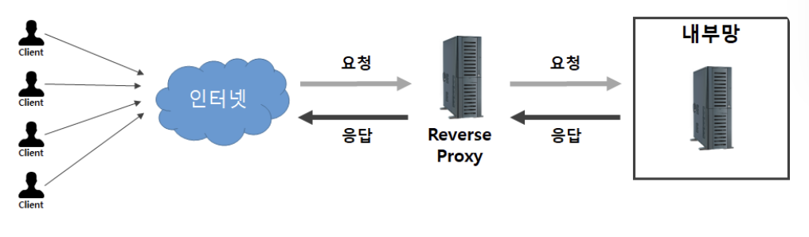

Nginx 는 웹 서버,프록시 서버 ,[[로드 밸런서]]등으로 널리 사용된다.

참고
- [[예약,결제 요청 건에 대한 Nginx 처리]]

## 📌 웹 서버
[Spring 내에서 client - server 의 요청 응답 방식](../Spring%20개념/spring%20내부/Spring%20내에서%20client%20-%20server%20의%20요청%20응답%20방식.md)

## 📌 프록시 서버
Nginx 는 2가지 방식의 프록시 서버를 구현할 수 있다.

###  ✅ 포워드 프록시 (Forward Proxy)

Forward Proxy 는 같은 내부망에 존재하는 클라이언트의 요청을 받아 인터넷을 통해 외부 서버에서 데이터를 가져와 클라이언트에게 응답해준다.

중복되는 여러 요청들에 대한 응답을 프록시 서버에 캐싱된 값을 클라이언트에게 바로 응답해주어 훨씬 빠르게 값을 전달할 수 있고 서버의 부하를 줄일 수 있다.

### ✅ 리버스 프록시 (Reverse Proxy)

Reverse Proxy 는 웹서버 / WAS 앞에 놓여 있는 것을 말한다. 
클라이언트는 웹  서비스에 접근할 때 웹 서버에 요청하는 것이 아닌 프록시로 요청하게 되고, 프록시 뒤에(reverse) 있는 서버로부터 데이터를 가져오는 방식이다. 
이렇게 클라이언트에게 서버의 정보를 감출 수 있다.

이렇게 Nginx의 리버스 프록시 기능을 사용하면 Web Server(Nginx)가 정적 컨텐츠를 바로 처리하고, WAS 는 동적 컨텐츠 요청만 처리할 수 있다. 즉, WAS 의 부담을 줄여 서버 자원을 효율적으로 사용할 수 있다.

### ✅ HTTPS 보안 인증

1. **연결 수립 및 핸드셰이크 (TLS Handshake)**
- 클라이언트가 80 포트로 요청을 했을 때 Nginx 는 443 포트 접속으로 우회한다.
- 아래 과정은 443포트로 접속을 시도했을 때 일어나는 과정이다.
	a. **TCP Connection** : 클라이언트와 Nginx 사이에 3-way handshake 
	b. **TLS Handshake** : TCP 연결 위에서 보안 정책 동작
	- Nginx -> Client : 공개키를 포함한 인증서 전송
	- Nginx <-> Client : 대칭키 생성하여 공유

2. **SSL Termination** 
- 암호화된 트래픽의 종착지 결정
	a. **클라이언트 -> Nginx** : 클라이언트가 보낸 데이터(HTTP 패킷)는 암호화되어 전송
	b. **Nginx 복호화** : Nginx 는 암호화된 패킷을 받아서 복호화
	- 암호화된 HTTPS 패킷 -> 평문인 HTTP 패킷으로 변환

2. **Reverse Proxy** 
- 복호화된 HTTP 요청을 docker network 를 통해 Spring 서버로 전달
- Nginx <-> Spring Server : 새로운 TCP 연결, HTTP 프로토콜을 사용하여 평문으로 통신
